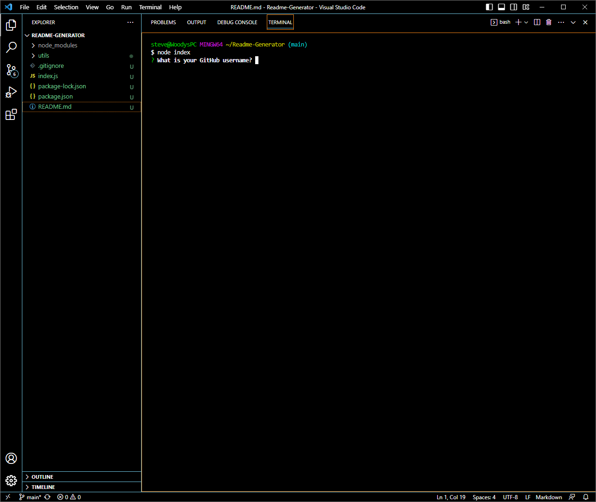
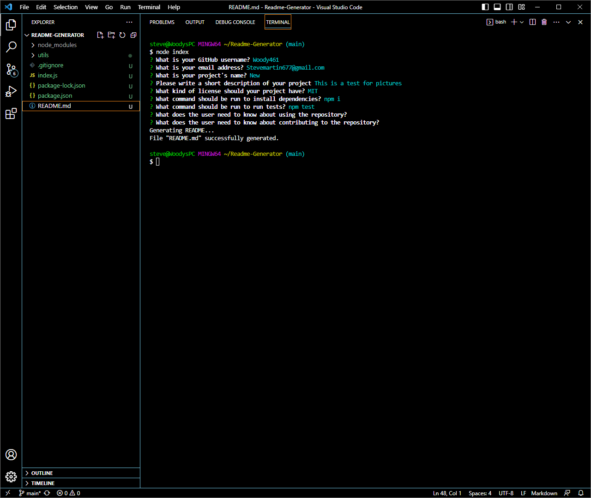
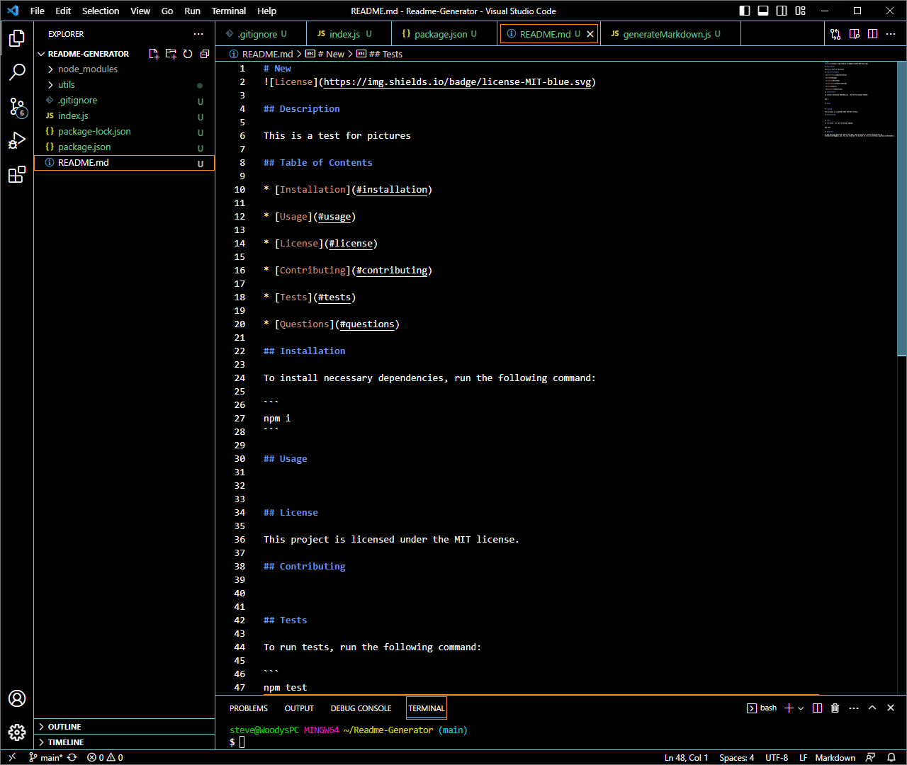

# Readme-Generator


<p>
  
  </p>

  <p>
  
  </p>

  <p>
  
  </p>
  
  </p>

## Description
AS A developer
I WANT a README generator
SO THAT I can quickly create a professional README for a new project

## Table of Contents 

* [Installation](#installation)

* [Usage](#usage)

* [License](#license)

* [Contributing](#contributing)

* [Tests](#tests)

* [Questions](#questions)

## Installation

To install necessary dependencies, run the following command:

```
npm i
```

## Usage
To use run node index


## License
  
This project is licensed under the MIT license.
    
## Contributing


## Tests

```

## Questions

If you have any questions about the repo, open an issue or contact me directly at Stevemartin677@gmail.com. You can find more of my work at [Woody461](https://github.com/Woody461/).

